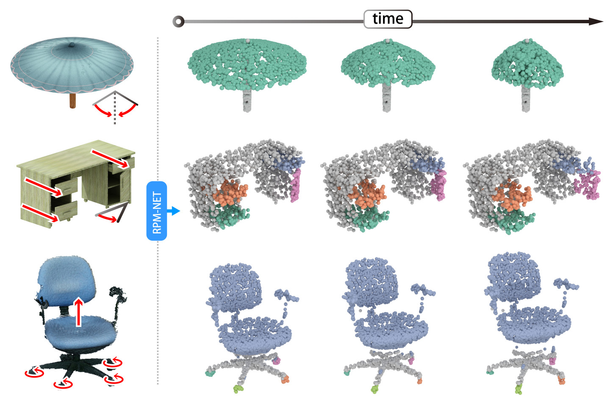
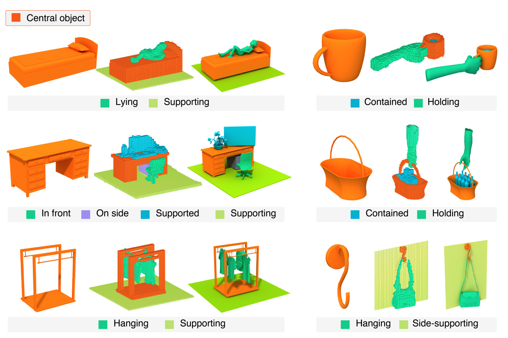

I am currently a fourth-year Ph.D. student at [Visual Computing research Center](https://vcc.tech), supervised by Prof. Hui Huang.

My research interests are robotic navigation, 3D shape understanding and point cloud analysis.

* * *

###  Education

*   2016.09 - _Present_ 
Shenzhen University 
Major: Computer Science and Technology

*   2012.09 - 2016.07 
University of Electronic Science and Technology of China 
Major: Electrical Engineering and Automation

###  Publication

**RPM-Net: Recurrent Prediction of Motion and Parts from Point Cloud** 

**Zihao Yan**, Ruizhen Hu, Xingguang Yan, Luanmin Chen, Oliver van Kaick, Hao Zhang, Hui Huang 
_ACM Transactions on Graphics_ (Proc. SIGGRAPH Asia), 2019 
[Project Page](http://vcc.szu.edu.cn/research/2019/RPMNet.html) 

**Predictive and Generative Neural Networks for Object Functionality** 

Ruizhen Hu, **Zihao Yan**, Jingwen Zhang, Oliver van Kaick, Ariel Shamir, Hao Zhang, Hui Huang 
_ACM Transactions on Graphics_ (Proc. SIGGRAPH), 2018 
[Project Page](http://vcc.szu.edu.cn/research/2018/ICON4.html) 

**Autonomous Reconstruction of Unknown Indoor Scenes Guided by Time-Varying Tensor Fields** 

Kai Xu, Lintao Zheng, **Zihao Yan**, Guohang Yan, Eugene Zhang, Matthias Niessner, Oliver Deussen, Daniel Cohen-Or, Hui Huang 
_ACM Transactions on Graphics_ (Proc. SIGGRAPH Asia), 2017 
[Project Page](http://kevinkaixu.net/projects/tfnav.html) 

###  Activity

*   2019/11/28 
    Attend SIGGRAPH Asia 2019 in Brisbane and present the paper "RPM-Net: Recurrent Prediction of Motion and Parts from Point Cloud".
*   2019/07/21 
    Visit Smart Geometry Processing Group of University Colledge London for 3 months.
*   2018/08/16 
    Attend SIGGRAPH 2018 in Vancouver and present the paper "Predictive and Generative Neural Networks for Object Functionality".
*   2017/11/25 
    Attend SIGGRAPH Asia 2017 in Bangkok.
*   2017/07/27 
    Attend SIGGRAPH 2017 in Los Angeles as Student Volunteer.
*   2016/12/05 
    Attend SIGGRAPH Asia 2016 in Macao.

