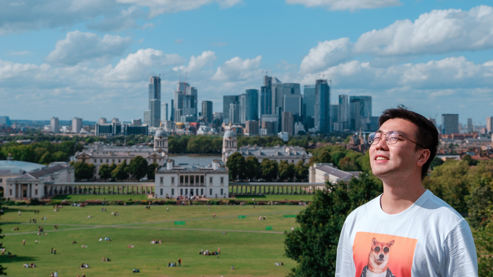
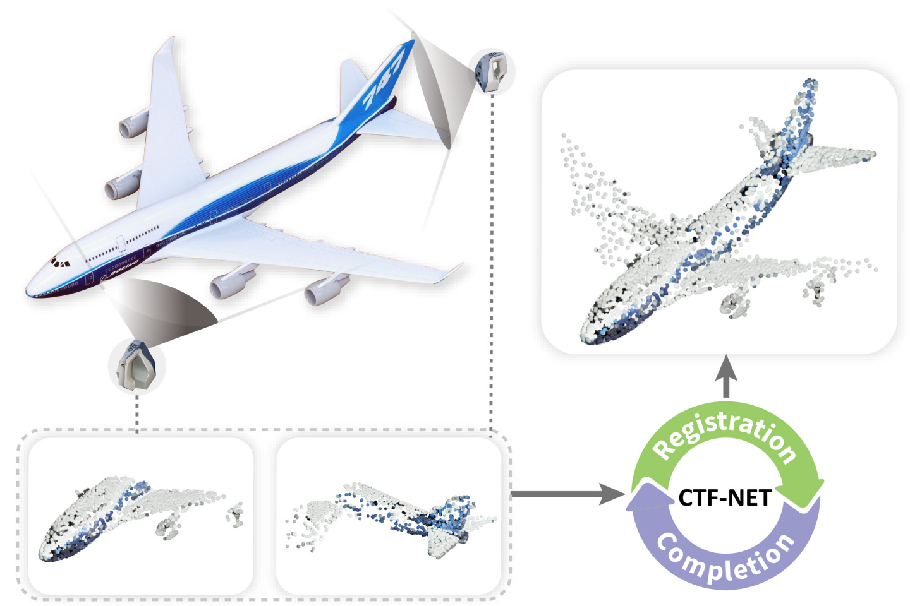
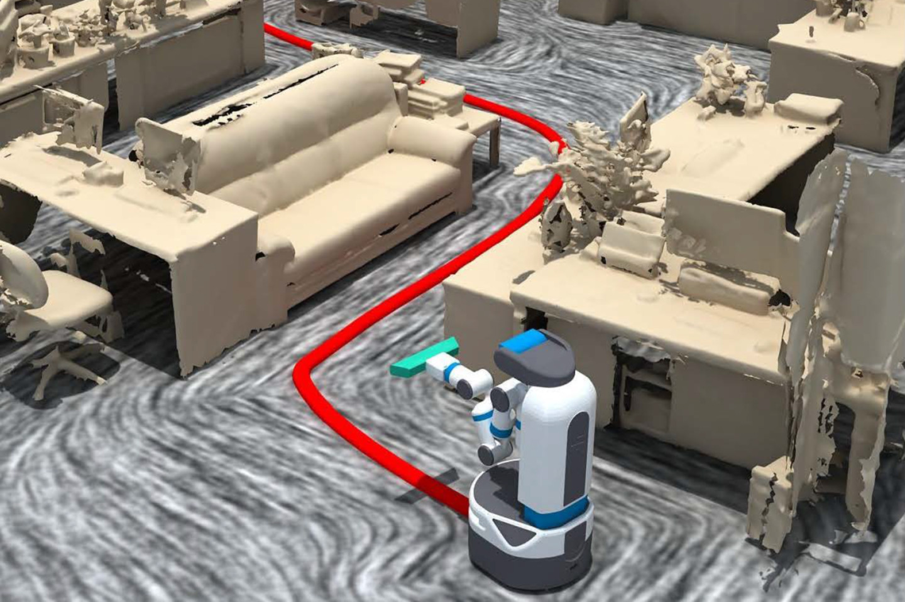

<!--  -->

I am currently a 3rd year Ph.D. student at [Visual Computing research Center](https://vcc.tech), supervised by Prof. [Hui Huang](https://vcc.tech/~huihuang).
I received my Bachelor Degree from [University of Electronic Science and Technology of China](https://en.uestc.edu.cn) in 2016.

My research interests are shape/scene understanding, point cloud analysis, 3D reconstruction.

I love taking photos in my spare time, welcome to [take a look](https://500px.me/salingo) :D 

* * *

## Publications

**_Consistent Two-Flow Network for Tele-Registration of Point Clouds_**　　　　　　　 
**Zihao Yan**, Zimu Yi, Ruizhen Hu, Niloy J. Mitra, Daniel Cohen-Or, Hui Huang 
_IEEE Transactions on Visualization and Computer Graphics_, 2021 
[Project Page](https://vcc.tech/research/2021/CTFNet) 

**_RPM-Net: Recurrent Prediction of Motion and Parts from Point Cloud_**　　　　　　　　 
**Zihao Yan**, Ruizhen Hu, Xingguang Yan, Luanmin Chen, Oliver van Kaick, Hao Zhang, Hui Huang 
_ACM Transactions on Graphics (Proc. SIGGRAPH Asia)_, 2019 
[Project Page](https://vcc.tech/research/2019/RPMNet) 

**_Predictive and Generative Neural Networks for Object Functionality_**　　　　　　　　 
Ruizhen Hu, **Zihao Yan**, Jingwen Zhang, Oliver van Kaick, Ariel Shamir, Hao Zhang, Hui Huang 
_ACM Transactions on Graphics (Proc. SIGGRAPH)_, 2018 
[Project Page](https://vcc.tech/research/2018/ICON4) 

**_Autonomous Reconstruction of Unknown Indoor Scenes Guided by Time-Varying Tensor Fields_** 
Kai Xu, Lintao Zheng, **Zihao Yan**, Guohang Yan, Eugene Zhang, Matthias Niessner, Oliver Deussen, Daniel Cohen-Or, Hui Huang 
_ACM Transactions on Graphics (Proc. SIGGRAPH Asia)_, 2017 
[Project Page](https://vcc.tech/research/2017/Fetch1) 
 

* * *

## Activities

○ 2019/11/28 
  Attend SIGGRAPH Asia 2019 in Brisbane and present the paper "_RPM-Net: Recurrent Prediction of Motion and Parts from Point Cloud_".

○ 2019/07/21 
  Visit [Smart Geometry Processing Group](https://geometry.cs.ucl.ac.uk) of University Colledge London for 3 months.

○ 2018/08/16 
  Attend SIGGRAPH 2018 in Vancouver and present the paper "_Predictive and Generative Neural Networks for Object Functionality_".

○ 2017/11/25 
  Attend SIGGRAPH Asia 2017 in Bangkok.

○ 2017/07/27 
  Attend SIGGRAPH 2017 in Los Angeles as [Student Volunteer](http://s2017.siggraph.org/student-volunteers.html).

○ 2016/12/05 
  Attend SIGGRAPH Asia 2016 in Macao.

