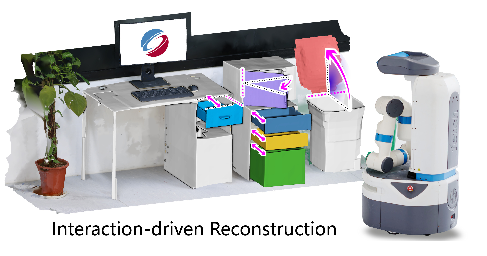

<!--  -->

I am currently a Postdoctoral researcher at [Visual Computing research Center](https://vcc.tech).
I obtained my Ph.D. degree under supervision of [Prof. Hui Huang](https://vcc.tech/~huihuang) and [Prof. Ruizhen Hu](http://csse.szu.edu.cn/staff/ruizhenhu) from [Shenzhen University](https://en.szu.edu.cn) in 2021.
I received my Bachelor degree from [University of Electronic Science and Technology of China](https://en.uestc.edu.cn) in 2016.

My research interests are shape/scene understanding, robot-based 3D reconstruction, point cloud analysis.

I love taking photos in my spare time, welcome to [take a look](https://500px.com/salingo) :D 

* * *

## Publications

**_Interaction-Driven Active 3D Reconstruction with Object Interiors_**　　　　　　　 
**Zihao Yan**, Fubao Su, Mingyang Wang, Ruizhen Hu, Hao Zhang, Hui Huang 
_ACM Transactions on Graphics (Proc. SIGGRAPH Asia)_, 2023 
[Project Page](https://github.com/Salingo/Interaction-Driven-Reconstruction) 

**_Consistent Two-Flow Network for Tele-Registration of Point Clouds_**　　　　　　　 
**Zihao Yan**, Zimu Yi, Ruizhen Hu, Niloy J. Mitra, Daniel Cohen-Or, Hui Huang 
_IEEE Transactions on Visualization and Computer Graphics_, 2021 
[Project Page](https://vcc.tech/research/2021/CTFNet) 

**_RPM-Net: Recurrent Prediction of Motion and Parts from Point Cloud_**　　　　　　　　 
**Zihao Yan**, Ruizhen Hu, Xingguang Yan, Luanmin Chen, Oliver van Kaick, Hao Zhang, Hui Huang 
_ACM Transactions on Graphics (Proc. SIGGRAPH Asia)_, 2019 
[Project Page](https://vcc.tech/research/2019/RPMNet) 

**_Predictive and Generative Neural Networks for Object Functionality_**　　　　　　　　 
Ruizhen Hu, **Zihao Yan**, Jingwen Zhang, Oliver van Kaick, Ariel Shamir, Hao Zhang, Hui Huang 
_ACM Transactions on Graphics (Proc. SIGGRAPH)_, 2018 
[Project Page](https://vcc.tech/research/2018/ICON4) 

**_Autonomous Reconstruction of Unknown Indoor Scenes Guided by Time-Varying Tensor Fields_** 
Kai Xu, Lintao Zheng, **Zihao Yan**, Guohang Yan, Eugene Zhang, Matthias Niessner, Oliver Deussen, Daniel Cohen-Or, Hui Huang 
_ACM Transactions on Graphics (Proc. SIGGRAPH Asia)_, 2017 
[Project Page](https://vcc.tech/research/2017/Fetch1) 
 

* * *

## Activities
○ 2021/11/19 
  Passed the oral defense of my Ph.D. dissertation.

○ 2021/06/21 
  Won the honor of Outstanding Student of Guangdong Province.

○ 2019/11/28 
  Attended SIGGRAPH Asia 2019 in Brisbane and present the paper "_RPM-Net: Recurrent Prediction of Motion and Parts from Point Cloud_".

○ 2019/07/21 
  Visited [Smart Geometry Processing Group](https://geometry.cs.ucl.ac.uk) of University Colledge London for 3 months.

○ 2018/08/16 
  Attended SIGGRAPH 2018 in Vancouver and presented the paper "_Predictive and Generative Neural Networks for Object Functionality_".

○ 2017/11/25 
  Attended SIGGRAPH Asia 2017 in Bangkok.

○ 2017/07/27 
  Attended SIGGRAPH 2017 in Los Angeles as [Student Volunteer](http://s2017.siggraph.org/student-volunteers.html).

○ 2016/12/05 
  Attended SIGGRAPH Asia 2016 in Macao.
